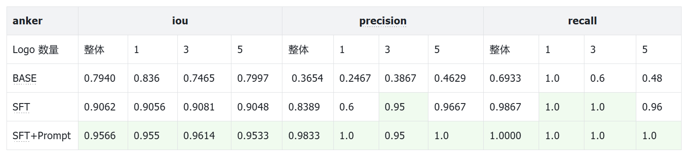
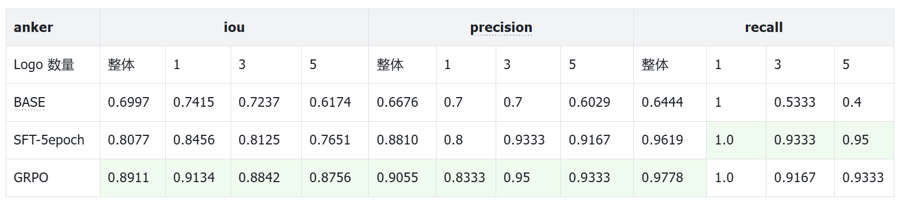
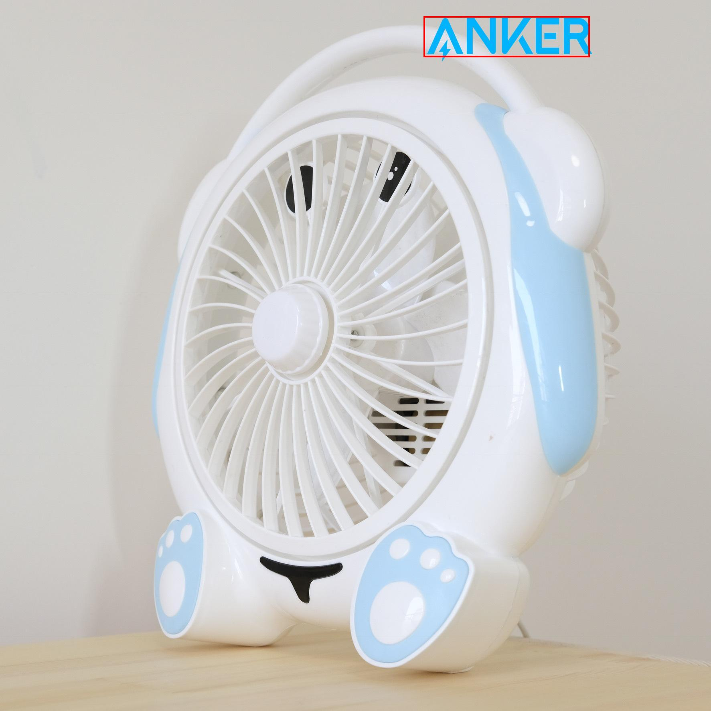
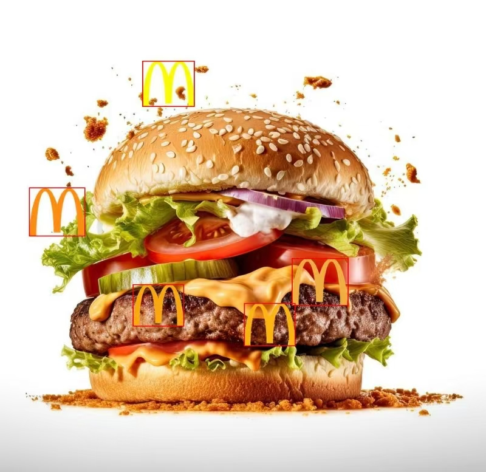
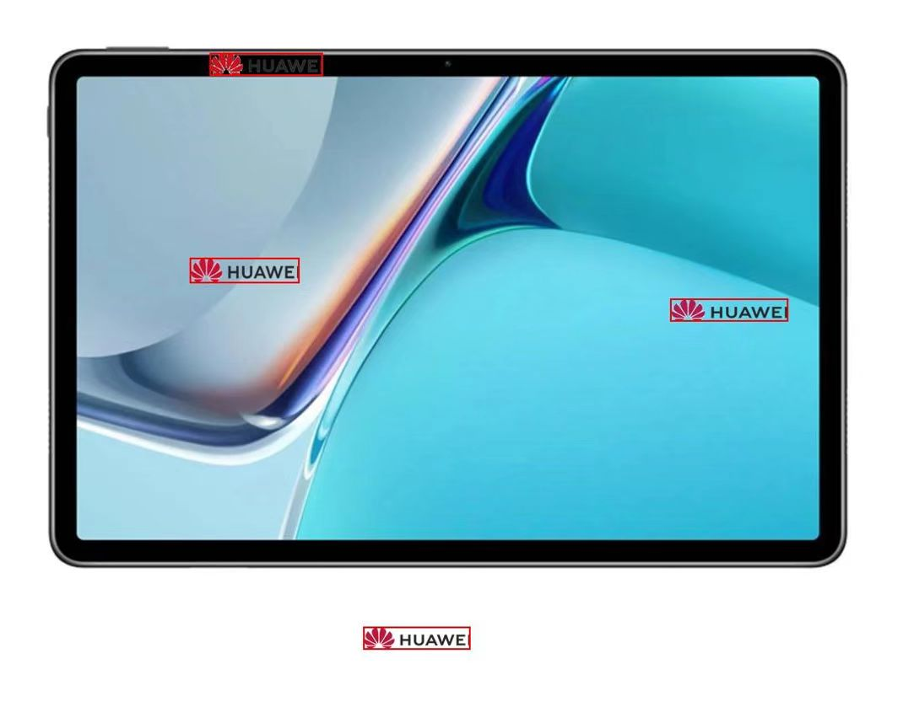

# VLM for Logo-Detection

SFT of Florence2 for few shot Logo Detection;  SFT + iou reward training with grpo of  VLM: Qwen2.5 VL for Logo Detection 

# Train
## Florence SFT
train lora
```nohup python lora.py > demo_lora_epoch_50_no_frozen.out &```

## Qwen2.5 VL SFT + GRPO

for sft training:
```bash Qwen_2_5VL/SFT/scripts/train.sh```

for GRPO training:
```python Qwen_2_5VL/GRPO/grpo.py```
reward design
- IOU reward: matched boxes's performance, using mIOU
- match reward: non match boxes 's performance, using F1 score

# results

## 指标
Florence2

Qwen2.5VL


## 真实效果展示
  
