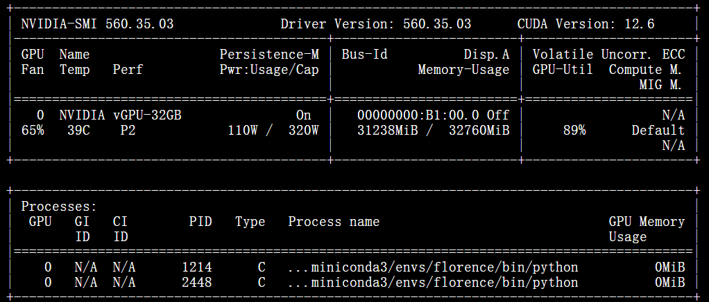

# Logo-Detection
use florence model for few shot special logo detection;  iou reward training with grpo for florence and VLMs 

train frozen visual parameter: NVIDIA-SMI


train lora
```nohup python lora.py > demo_lora_epoch_50_no_frozen.out &```

lora setting: lora_rank = 4 , lora_alpha = 8, lora_dropout = 0.05 

trainable params: 3,334,500 || all params: 826,028,388 || trainable%: 0.4037


one epoch train time: 4.5 min

train with RL: use IOU reward ...

evaluate: evaluate.py